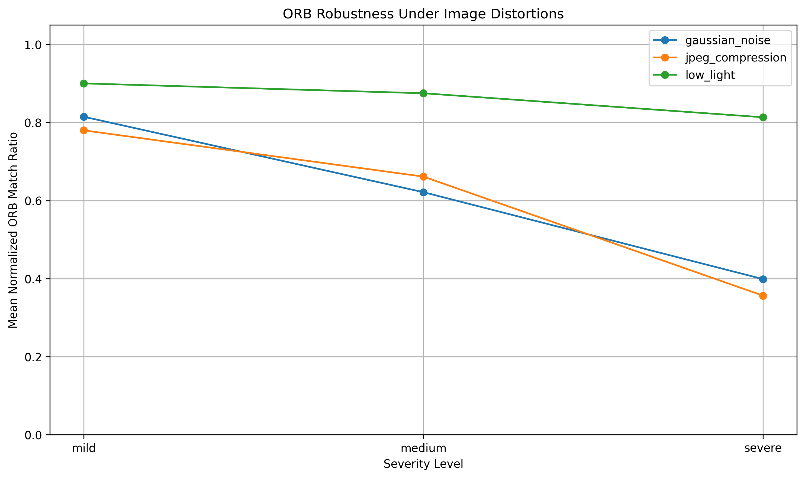
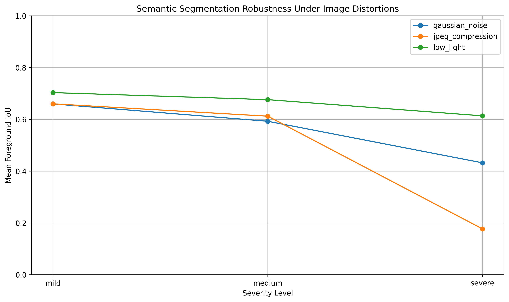
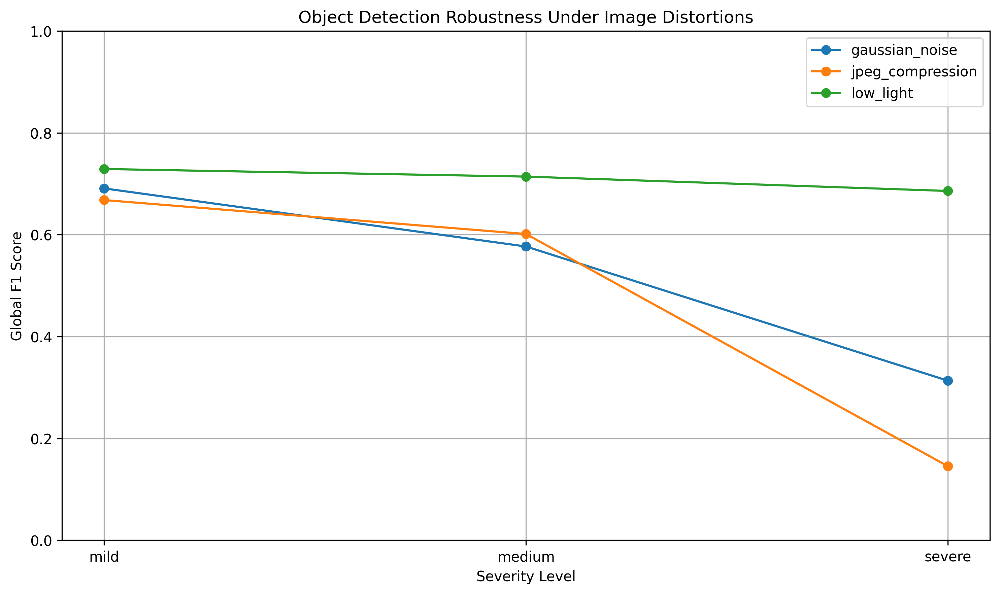
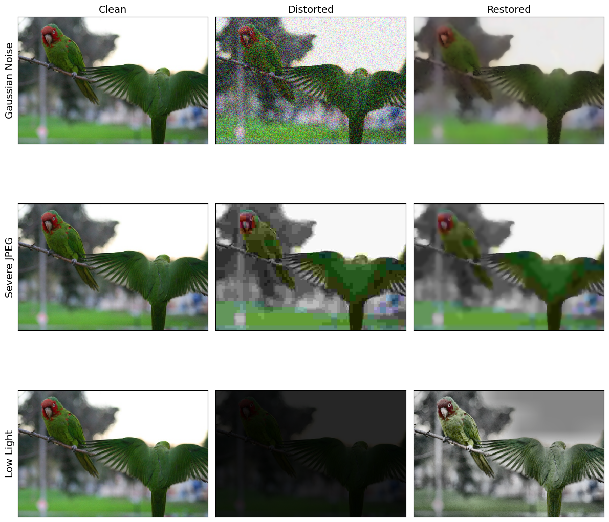
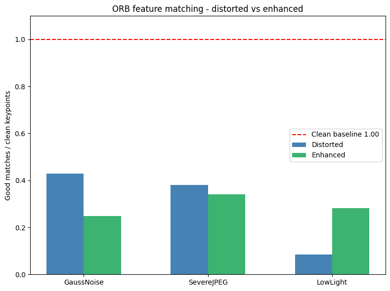
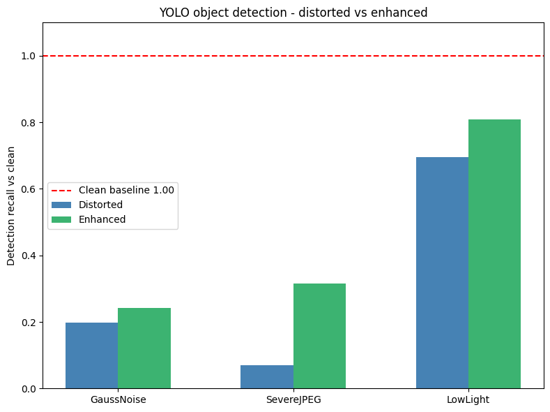
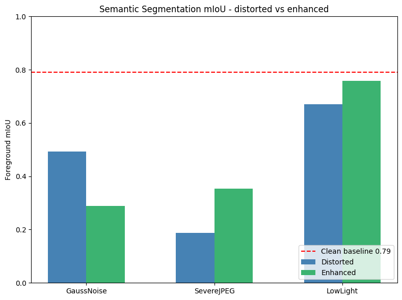
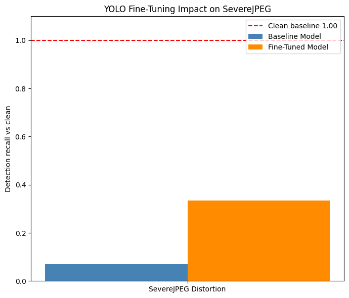
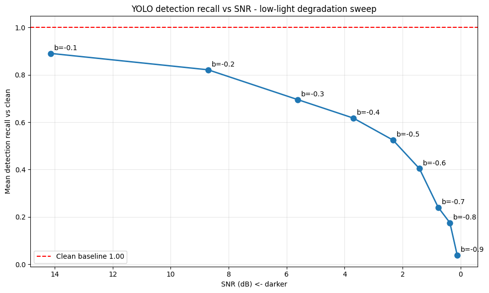

# Robustness Evaluation of Classical and Deep Computer Vision Methods

Image Processing Course Project

## Overview

This project evaluates the robustness of computer vision methods under controlled image distortions. It uses the PASCAL VOC 2012 `train` split and compares one classical method, ORB feature detection and matching, with two pretrained deep learning models: DeepLabV3-ResNet50 for semantic segmentation and YOLO11n for object detection.

The implementation includes dataset exploration, clean baseline evaluation, distortion generation, robustness analysis, and an image enhancement stage. Finally, we performed fine-tuning and a gradual Signal-to-Noise Ratio (SNR) sweep to thoroughly evaluate the models' limits.

## Table of Contents

- [Project Requirements](#project-requirements)
- [Dataset](#dataset)
- [Computer Vision Tasks](#computer-vision-tasks)
- [Image Distortions](#image-distortions)
- [Evaluation Pipeline](#evaluation-pipeline)
- [Current Results](#current-results)
- [Visual Results](#visual-results)
- [Repository Structure](#repository-structure)
- [Notebook Guide](#notebook-guide)
- [Installation](#installation)
- [Usage](#usage)
- [Reproducibility](#reproducibility)
- [Project Status](#project-status)
- [Limitations](#limitations)
- [References](#references)
- [Authors](#authors)

## Project Requirements

The course project requires:

- A public dataset with ground-truth annotations
- Three computer vision tasks
- Classical and deep learning methods
- Three image distortions
- Quantitative evaluation on clean and distorted images
- An enhancement or fine-tuning stage

## Dataset

- Dataset: PASCAL VOC 2012
- Split: `train`
- Loader: `torchvision.datasets.VOCSegmentation`
- Sample size: fixed subset of 100 images
- Random seed: `10`
- Class coverage: all 20 VOC foreground classes are represented
- Ground truth:
  - Semantic segmentation masks
  - VOC XML object-detection annotations
  - Ignore label `255` excluded from segmentation evaluation

Saved dataset artifacts:

- `results/selected_indices.csv`
- `results/selected_image_sizes.csv`
- `results/segmentation_class_summary.csv`
- `results/detection_class_summary.csv`

## Computer Vision Tasks

### ORB Feature Detection and Matching

- Method: OpenCV ORB
- Configuration: `cv2.ORB_create(nfeatures=1500)`
- Matching: Hamming-distance brute-force matching with `knnMatch(..., k=2)`
- Ratio test: `0.75`
- Robustness metric: normalized match ratio between clean and distorted descriptors
- Key outputs: `orb_clean_summary.csv`, `orb_distortion_summary.csv`

### Semantic Segmentation

- Model: DeepLabV3-ResNet50
- Weights: `DeepLabV3_ResNet50_Weights.DEFAULT`
- Evaluation: predicted masks compared with PASCAL VOC masks
- Ignore handling: VOC label `255` is excluded
- Metrics: per-image mIoU, dataset mIoU, and foreground mIoU
- Key outputs: `segmentation_clean_summary.csv`, `segmentation_distortion_summary.csv`

### Object Detection

- Model: Ultralytics `YOLO("yolo11n.pt")`
- Confidence threshold: `0.25`
- IoU threshold: `0.5`
- Evaluation: YOLO predictions compared with VOC XML boxes
- VOC handling: difficult objects ignored; selected COCO class names are mapped to VOC equivalents
- Matching: class-aware greedy one-to-one assignment
- Metrics: precision, recall, F1-score, and matched IoU
- Key outputs: `detection_clean_summary.csv`, `detection_distortion_summary.csv`

## Image Distortions

| Distortion | Mild | Medium | Severe | Implementation |
|---|---:|---:|---:|---|
| Gaussian noise | sigma `10` | sigma `25` | sigma `50` | Adds zero-mean Gaussian RGB noise and clips to `[0, 255]` |
| JPEG compression | quality `50` | quality `20` | quality `5` | Saves and reloads each RGB image through an in-memory JPEG buffer |
| Low light | factor `0.6` | factor `0.35` | factor `0.15` | Multiplies RGB pixel values by the brightness factor |

SNR is computed in dB as `10 * log10(signal_power / error_power)`, using the clean image as the signal and the clean-distorted difference as the error.

The distortion configuration is saved to `results/distortion_config.csv`.

## Image Enhancements & Restoration

To test if classical image processing can recover model performance, we applied specific enhancements to the severely distorted images:
- **Gaussian Noise:** Non-Local Means (NLM) denoising combined with a Bilateral Filter to smooth grain while preserving edges.
- **Severe JPEG:** Aggressive Bilateral Filtering to smooth out harsh block artifacts while keeping object boundaries intact.
- **Low Light:** Gamma correction followed by CLAHE (Contrast Limited Adaptive Histogram Equalization) in the LAB color space to stretch local contrast.


## Evaluation Pipeline

```text
PASCAL VOC 2012
-> Fixed 100-image subset
-> Clean baseline
-> Distortion generation
-> Robustness evaluation
-> Image enhancement and final comparison (planned)
```

## Current Results

### Clean Baseline

| Task | Clean result |
|---|---|
| ORB | Mean keypoints `1336.09`; median `1441`; `18` images reached the 1500-feature cap |
| Semantic segmentation | Dataset foreground mIoU `0.777`; mean per-image foreground mIoU `0.700` |
| Object detection | Global precision `0.651`; recall `0.808`; F1 `0.721`; mean matched IoU `0.871` |

### Main Robustness Findings

- Gaussian noise causes gradual degradation across all tasks. At severe noise, ORB normalized match ratio falls to `0.399`, segmentation foreground mIoU to `0.493`, and detection F1 to `0.313`.
- Severe JPEG compression produces the strongest degradation for segmentation and detection, with foreground mIoU `0.174` and detection F1 `0.145`.
- Low light sharply reduces the absolute number of ORB matches. At severe low light, ORB keeps a normalized match ratio of `0.813`, but mean good matches drop to `62.83`.
- YOLO is comparatively robust to the tested low-light range: detection F1 is `0.729`, `0.714`, and `0.686` for mild, medium, and severe low light.

### Enhancement, Fine-Tuning, and SNR Findings

- **The Paradox of Denoising:** Applying classical denoising and smoothing (NLM + Bilateral) to Gaussian noise actually *hurt* ORB matching and DeepLabV3 segmentation. While visually pleasing to the human eye, smoothing destroys the sharp edges and gradients that ORB relies on, and blurs the precise pixel boundaries needed for semantic segmentation.
- **JPEG Artifacts & YOLO:** YOLO completely failed on severe JPEG compression (recall dropped to 6.9%). However, smoothing the block artifacts with an aggressive Bilateral filter boosted recall to 31.6%.
- **Low Light Resilience:** Deep learning models (YOLO and DeepLab) showed natural resilience to low light. Enhancing the images with CLAHE further improved their performance, pushing YOLO detection recall from 69.6% to 80.9%.
- **Fine-Tuning Success:** Fine-tuning YOLO on pseudo-labeled severely compressed JPEG images yielded a massive improvement, jumping from a baseline detection recall of 7.1% to 33.4% on distorted images. 
- **SNR "Cliff" Effect:** A gradual SNR sweep on low-light distortions revealed a non-linear degradation in YOLO's performance. The model maintained strong robustness until a brightness factor of `-0.6` (SNR ~1.4 dB), after which performance dropped off a cliff, crashing from 40.4% recall to 3.8% at `-0.9`.


## Visual Results





















## Repository Structure

```text
.
+-- README.md
+-- 3002_CousreProject.pdf                  # project instructions
+-- requirements.txt                        # Python dependencies
+-- notebooks/
|   +-- 01_dataset_exploration.ipynb
|   +-- 02_clean_baseline.ipynb
|   +-- 03_distortions.ipynb
|   +-- 04_image_enhancement.ipynb
|   +-- 05_fine_tuning.ipynb
+-- results/                                # generated CSV summaries and detailed evaluations
+-- figures/                                # generated visual examples and performance plots
```

## Notebook Guide

### `01_dataset_exploration.ipynb`

Loads PASCAL VOC 2012, sets the fixed seed, selects the 100-image subset, verifies class coverage, visualizes segmentation and detection ground truth, and saves dataset metadata to `results/` and `figures/`.

### `02_clean_baseline.ipynb`

Runs clean-image baselines for ORB, DeepLabV3-ResNet50, and YOLO11n. It saves per-image and aggregate metrics for feature detection, segmentation, and object detection.

### `03_distortions.ipynb`

Defines the three distortions, computes SNR, evaluates all three tasks under every distortion-severity combination, and saves robustness summaries and plots.

### `04_image_enhancement.ipynb`
Applies classical image processing filters (NLM, Bilateral, CLAHE) to the distorted images and evaluates the performance recovery of ORB, DeepLabV3, and YOLO compared to the distorted baseline.

### `05_fine_tuning.ipynb`
Demonstrates model recovery through deep learning by generating pseudo-labels from clean images, fine-tuning YOLO on severe JPEG distortions, and performing a gradual SNR degradation sweep for low-light conditions.


## Installation

```bash
pip install -r requirements.txt
```

Optional:

```bash
jupyter notebook
```

## Usage

Run the notebooks in order:

```text
01_dataset_exploration.ipynb
02_clean_baseline.ipynb
03_distortions.ipynb
04_image_enhancement.ipynb (planned)
```

The notebooks use repository-relative paths. PASCAL VOC 2012 is downloaded or loaded through `torchvision` according to the notebook configuration. Outputs are saved to `results/` and `figures/`.

## Reproducibility

- Fixed random seed: `10`
- Fixed sample size: 100 images
- Saved sample indices: `results/selected_indices.csv`
- Repository-relative paths for `data/`, `results/`, and `figures/`
- Dependencies installed from `requirements.txt`
- Saved CSV results and figures for completed stages

## Project Status

- [x] Dataset exploration
- [x] Clean baseline evaluation
- [x] Distortion generation
- [x] Robustness evaluation
- [x] Image enhancement
- [x] Evaluation after enhancement
- [x] Fine-tuning, if required
- [x] Final comparison and reporting


## Limitations

- Evaluation uses a fixed subset of 100 images.
- Results are specific to the selected distortions and severity levels.

## References

- [PASCAL VOC 2012](http://host.robots.ox.ac.uk/pascal/VOC/voc2012/)
- [OpenCV ORB Documentation](https://docs.opencv.org/4.x/db/d95/classcv_1_1ORB.html)
- [Torchvision DeepLabV3 Documentation](https://pytorch.org/vision/stable/models/deeplabv3.html)
- [Ultralytics YOLO Documentation](https://docs.ultralytics.com/)

## Authors

- Eve Yatzkan
- Maayan Zelig
